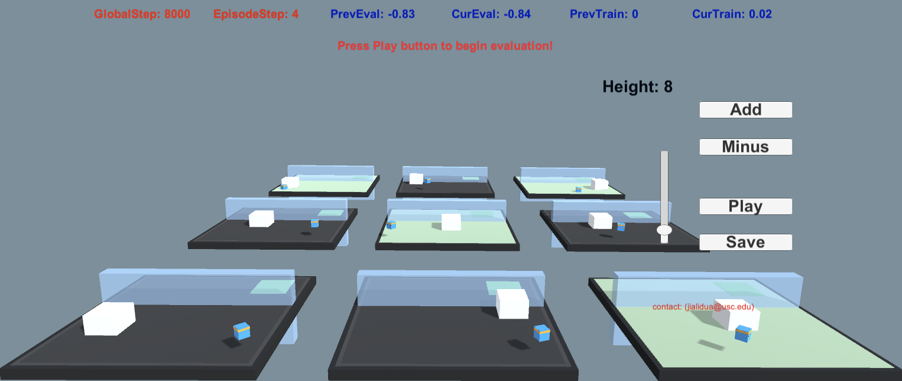

# Interactive Curriculum Reinforcement Learning

Jiali Duan, Yilei Zeng, Li Yang, Lerrel Pinto, C.-C. Jay Kuo, Stefanos Nikolaidis

This project is built upon the popular Unity Game Engine, not for commercial use.

### Table of Content
- Installation
	- Not required. Dependencies have been built into a binary executable (MAC). Download the executable <a href="https://drive.google.com/file/d/1qXGxU6he_3ycbahLQe5UYgYhdcxuY7nY/view?usp=sharing">here</a>, and put it under user-study-mac folder.
	
- How to Run?
	1. `cd user-study-mac`
	2. Change executable permission: `chmod +x learn`
	3. `./learn`

- How to Interact?
	- The window will automatically minimize during training while maximize for evaluation and interaction. Instructions are shown in screen. Refer to instructions.pdf for more information. 

- Others
	- there's a 30-day expiration period for the executable. 

## Maintainer
Jiali Duan (Email: jialidua@usc.edu)