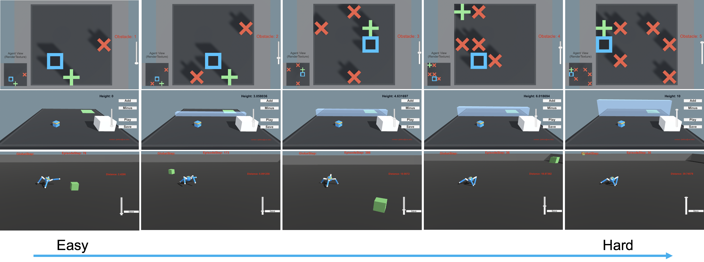

# Interactive Curriculum Reinforcement Learning

Reinforcement learning is hard, particularly for tasks that receive sparse rewards or tasks that require a change of skills. Curriculum reinforcement learning partly mitigates the learning curve, by decomposing a hard task into easy ones.  A question that follows is how curriculum should be designed. We explore prior from human to build an interactive curriculum framework for reinforcement learning.




## Features
1. Online interaction in training
	- Translate/Rotate
	- Adding new objects
	- Pause/resume 
	- Instruction displays
2. Curriculum evaluation
	- Goal task evaluation
3. Highly scalable
	- Parallelization for human interaction
	- Parallelization for reinforcement learning


## Table of Content

### Installation
Not required. Dependencies have been built into a binary executable (MAC). Download the executable <a href="https://drive.google.com/file/d/1qXGxU6he_3ycbahLQe5UYgYhdcxuY7nY/view?usp=sharing">here</a>, and put it under user-study-mac folder. The folder structure should look like: 
```
- LICENSE
- Project
  - Builds
    - multi-jump-10000-restrict.app
- config
  - train_config.yaml
- learn
- models
- summaries
```
	
### How to Run?
1. `cd user-study-mac`
2. Change executable permission: `chmod +x learn`
3. `./learn`

### How to Interact?
Refer to instructions.pdf for more information. 

1. Slide bar and buttons are used to change the scene layout 
2. The window will automatically minimize during training while maximize for evaluation and interaction.


### Other
This project is built upon the popular Unity Game Engine, for demonstration purpose and is not for commercial use.
In the released environment, we've restricted part of the functions and allow interactions to happen at fixed interval (every 10K global step). 
Right now, there's a 30-day expiration period for the executable. 


## Citation

```
@misc{JialiDuan2020,
  author = {Jiali Duan, Yilei Zeng, Li Yang, Lerrel Pinto, C.-C. Jay Kuo, Stefanos Nikolaidis},
  title = {Interactive Curriculum Reinforcement Learning},
  year = {2020},
  publisher = {GitHub},
  journal = {GitHub repository},
  howpublished = {\url{https://github.com/davidsonic/interactive-curriculum-reinforcement-learning}},
}
```
## Contact Me
Jiali Duan (Email: jialidua@usc.edu)